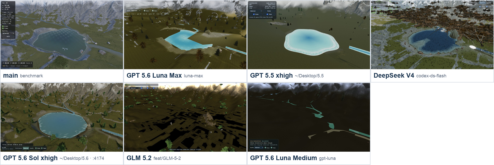
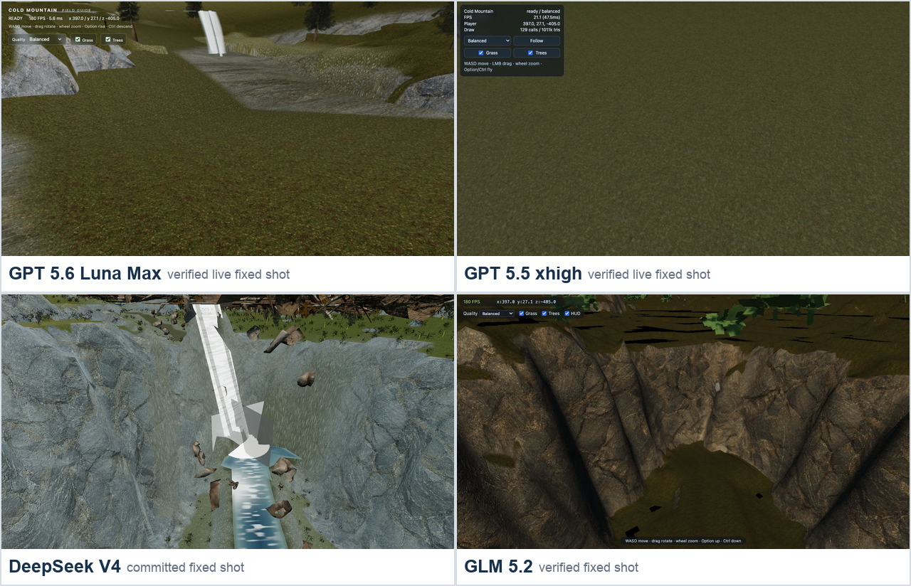

# Cold Mountain 多模型实现评测报告

> 评测日期：2026-08-02  
> 目标规范：`project-prompt.md`  
> 统一画质与机位：`?shot=vista&quality=balanced&seed=12345&capture=0`  
> 统一视口：1280 × 720 CSS  
> 评测环境：Node.js 24.13.1、npm 11.8.0

## 结论摘要

`main` 是明显的视觉标杆，总分 **84.5/100**；它包含 GPT 5.6 Sol ultra 的结果和后续手动调试，因此不参与“纯模型第一名”的归属。

五个纯模型分支中：

1. **GPT 5.5 xhigh（63.5）**：宏观地形和材质层次最接近成片，草模型仍存在明显青色/黑色 alpha 碎片；本轮没有取得可信的稳态 10 秒性能样本。
2. **DeepSeek V4 Flash max（57.5）**：代码覆盖和模块边界最好，但运行结果把题面要求的第三人称做成了第一人称；同时树资产归一化失败，大量树木横倒或悬浮。
3. **GPT 5.6 Sol xhigh（56.0）**：启动和表面 FPS 很好，但草 shader 编译失败、湖面存在同心环和三角缺口，当前渲染负载不完整。
4. **GLM 5.2 xhigh（39.5）**：测试最多、模块清楚，但 ready 初始化 TDZ 与 water shader attribute 缺失导致大片黑洞和水体缺失。
5. **GPT 5.6 Luna medium（37.5）**：代码最短、运行稳定、帧率高，但画面是强简化的低多边形原型，和目标 PBR 山地世界差距最大。

需要强调：**五个纯模型分支都没有通过题面规定的产品等价门槛**。题面明确禁止用高 FPS、少 draw calls 或测试数量抵消主体缺失、占位几何和宏观布局错误。因此下方“纯模型排名”只表示这些仓库快照之间的相对完成度，不等于可交付验收通过。

## 1. 评分方法

总分 100，按用户要求拆成代码逻辑、视觉效果、性能帧率三大项：

| 一级维度 | 权重 | 二级维度 | 评分原则 |
|---|---:|---|---|
| 代码逻辑 | 40 | 规范正确性 14、架构职责 10、图形/算法质量 8、测试与交付可信度 8 | 以代码路径、构建测试、浏览器错误和题面契约为证据；代码量本身不加分 |
| 视觉效果 | 40 | 地形 8、水系 7、植被 7、构图/世界完整性 7、材质/光照 6、稳定性 5 | 以 production preview 最终帧为主；贴图、树木、草地、河流、湖泊、瀑布均单独观察 |
| 性能帧率 | 20 | 稳态 FPS/帧时间 8、可见内容等价下的负载效率 6、p95/1% low 稳定性 3、指标可信度 3 | 启动/等待时长只记录、不计分；缺草、缺水、黑洞造成的高 FPS 必须折价 |

### 不可补偿原则

以下情况先触发产品门槛失败，再继续记录诊断分数：

- 固定机位主体缺失、宏观锚点明显错误或只剩占位几何；
- shader 编译错误导致草、水或地形层未渲染；
- 把简化内容带来的高 FPS 当作完整场景性能；
- 性能窗口不足 10 秒、样本数过少，或 renderer 指标与画面明显不一致；
- 仅有测试/配置声明，却没有浏览器最终帧证据。

## 2. 总体排名

| 名次 | 分支 | 对应模型 | 代码 /40 | 视觉 /40 | 性能 /20 | 总分 /100 | 产品门槛 |
|---:|---|---|---:|---:|---:|---:|---|
| 标杆 | `main` | GPT 5.6 Sol ultra + 手动调试 | 34.0 | 35.5 | 15.0 | **84.5** | 视觉通过；严格 v2 契约不完整 |
| 1 | `feat/gpt-5.5-test` | GPT 5.5 xhigh | 30.5 | 25.0 | 8.0 | **63.5** | 未通过 |
| 2 | `codex-ds-flash` | DeepSeek V4 Flash max | 28.5 | 18.0 | 11.0 | **57.5** | 未通过：第一人称替代第三人称 |
| 3 | `test/sol-2` | GPT 5.6 Sol xhigh | 26.5 | 20.5 | 9.0 | **56.0** | 未通过 |
| 4 | `feat/GLM-5-2` | GLM 5.2 xhigh | 24.5 | 8.5 | 6.5 | **39.5** | 未通过 |
| 5 | `gpt-luna` | GPT 5.6 Luna medium | 15.0 | 10.5 | 12.0 | **37.5** | 未通过 |

DeepSeek 与 Sol 相差 1.5 分，仍可视为相邻档：前者的系统架构更完整，但第一/第三人称错误和树木方向错误都直接影响实际体验；后者规模更适中，但草 shader 与湖面几何仍未达标。

## 3. 全景截图对比

下图统一比较 `vista / Balanced / seed=12345`。除 GPT 5.5 外，其余五张是本轮重新启动 production build 后取得的最终帧；GPT 5.5 因当前 production preview 主线程阻塞超过 60 秒，使用该分支提交的固定机位 production 截图，并在性能项中按“当前无有效样本”处理。

### 直接观察

- **main**：山体、湖泊、岩石、草地、树群、湿岸、远景雾和玩家尺度最完整；近景到远景都有层次。
- **GPT 5.5**：雪山和谷地的宏观构图良好，地形表面有材质变化；湖水偏灰白，植被密度和完整性落后于 main。
- **DeepSeek V4 Flash**：湖泊和大地形存在，但运行体验呈现为第一人称，没有交付题面要求的可见第三人称角色与跟随构图；树木主轴也错误，成片横倒/悬浮并遮挡镜头。
- **GPT 5.6 Sol**：湖面有明显同心环，岸边出现三角楔形缺口；草 shader 失败使地面负载和生态层不完整。
- **GLM 5.2**：大面积黑色地形孔洞，水体缺失，只有零散植被与调试 HUD 可见。
- **GPT 5.6 Luna**：地表过暗，河湖/道路近似平面色带，植被极少，整体更像低多边形概念验证。

原始截图：[`main`](screenshots/main-vista.png) · [`GPT 5.5`](screenshots/gpt-5-5-vista.png) · [`DeepSeek`](screenshots/deepseek-v4-flash-vista.png) · [`Sol`](screenshots/gpt-5-6-sol-vista.png) · [`GLM`](screenshots/glm-5-2-vista.png) · [`Luna`](screenshots/gpt-5-6-luna-vista.png)

## 4. 瀑布专项截图对比

瀑布图用于补充观察水体几何、白水、落差和岩壁融合。该组只有四个分支具备可用的分支固定机位证据，因此不用于单独计算统一 FPS。

- **GPT 5.5**：峡谷地形成立，但瀑布主体接近白色贴片，水体与落水潭的连续性较弱。
- **DeepSeek V4 Flash**：具备落水、河槽和白水结构，但白色条块过硬，周围横倒树木继续破坏可信度。
- **GPT 5.6 Luna**：瀑布是青色竖直平面与简单水带，几何和光学均为占位级。
- **GLM 5.2**：岩壁细节尚可，但水体/白水未形成有效的瀑布视觉主体。

原始截图：[`GPT 5.5`](screenshots/gpt-5-5-waterfall.png) · [`DeepSeek`](screenshots/deepseek-v4-flash-waterfall.png) · [`Luna`](screenshots/gpt-5-6-luna-waterfall.png) · [`GLM`](screenshots/glm-5-2-waterfall.png)

## 5. 视觉评分明细

| 分支 | 地形 /8 | 水系 /7 | 植被 /7 | 构图与完整性 /7 | 材质与光照 /6 | 稳定性 /5 | 视觉总分 /40 |
|---|---:|---:|---:|---:|---:|---:|---:|
| `main` | 7.5 | 6.5 | 6.0 | 6.0 | 5.5 | 4.0 | **35.5** |
| `feat/gpt-5.5-test` | 7.0 | 5.5 | 3.0 | 2.5 | 5.0 | 2.0 | **25.0** |
| `test/sol-2` | 6.0 | 4.0 | 2.5 | 2.0 | 4.0 | 2.0 | **20.5** |
| `codex-ds-flash` | 6.0 | 4.5 | 2.5 | 0.0 | 4.0 | 1.0 | **18.0** |
| `gpt-luna` | 3.0 | 2.0 | 1.5 | 1.0 | 1.5 | 1.5 | **10.5** |
| `feat/GLM-5-2` | 3.0 | 1.5 | 0.5 | 1.5 | 1.5 | 0.5 | **8.5** |

DeepSeek 的视觉分低于 Sol，并不是因为系统内容少；恰恰相反，它渲染了大量树木和较完整的世界层。扣分一方面来自树木以错误方向覆盖画面，另一方面来自运行结果以第一人称替代强制要求的第三人称。两者都属于“源码中存在对应系统，但最终体验没有正确交付”。

## 6. 性能与帧率

### 当前运行证据

启动与进入完整稳定帧的等待时间保留为诊断记录，但**不参与性能评分**。理由是标杆 `main` 同样约需 60 秒，横向评分应集中比较稳定后的渲染能力、内容负载、尾延迟和指标可信度。

规则修订后，main 性能分由 13.0 调整为 15.0，GPT 5.5 由 5.5 调整为 8.0，DeepSeek 由 10.0 调整为 11.0；Sol、GLM、Luna 原先的主要扣分来自内容缺失、指标失真或视觉强简化，因此保持不变。

| 分支 | 当前 HUD FPS | Draw calls | Triangles | 加载等待（仅记录） | 性能分 /20 | 解释 |
|---|---:|---:|---:|---|---:|---|
| `main` | **42.1**（10 次：41–43） | 1,731 | 17.20 M | 约 60 秒 | 15.0 | 内容最完整，稳态帧率可信；主要扣分来自 1,731 calls 与 17.2M triangles 的负载成本 |
| `feat/gpt-5.5-test` | **N/A** | 230¹ | 2.17 M¹ | 当前运行 >60 秒 | 8.0 | 不因等待时间扣分；但提交值 71.6 FPS 只有 3 帧/41.9 ms，缺少可信稳态窗口 |
| `codex-ds-flash` | **53.0**（10 次均为 53） | 470¹ | 21.54 M¹ | 提交的 `readyMs=20615` | 11.0 | 不因 readyMs 扣分；提交快照仍显示 35.48 FPS、p95 91.8 ms、1% low 4 FPS |
| `test/sol-2` | **115.5**（115–116） | N/A | N/A | 约 18 秒 | 9.0 | 草 shader 失败；HUD 显示 1 call / 0k tris，与画面不符，不能视为完整场景性能 |
| `feat/GLM-5-2` | **140.3**（138–142） | N/A | N/A | 约 18 秒 | 6.5 | 水体 shader 失败且地形有大片孔洞，高 FPS 来自缺失负载 |
| `gpt-luna` | **120.0**（118–122） | 215 | N/A | 约 12 秒 | 12.0 | 指标稳定，但视觉内容强简化，不能与 main 的完整负载直接比较 |

¹ 来自分支提交的验收快照；不是本轮统一 HUD 读取值。

### 性能结论

- 在**当前真实可见内容**下，main 的 42 FPS 是最可信的完整场景参考。
- DeepSeek 的当前 53 FPS 看似更高，但 21.54M triangles 和提交快照中的极差尾延迟说明流畅度不稳定；同时横倒树木使画面不合格。
- Luna 的 120 FPS 是“轻量原型”的有效结果，却不是和 main 同等视觉内容下的效率胜利。
- Sol 与 GLM 的 115–140 FPS 受 shader/场景缺失污染，不能作为模型性能优势。
- GPT 5.5 当前没有取得有效稳态帧率，因此只在“稳态证据与指标可信度”上少拿分；同步 `24×24` chunk 构建和 >60 秒等待不单独扣性能分。

## 7. 代码逻辑与工程质量

### 构建、测试和规模

六个分支均完成 `npm ci`、`npm test`、`npm run build`：

| 分支 | src 文件 / LOC | test 文件 / LOC | 测试 | 生产 JS | 主要代码证据 |
|---|---:|---:|---:|---:|---|
| `main` | 50 / 23,827 | 39 / 11,330 | 276/276 | 1,220.58 kB | 视觉系统和专项测试最丰富；未按当前题面统一到 v2 `SCENE_LAYOUT/API` |
| `feat/gpt-5.5-test` | 14 / 3,445 | 5 / 317 | 33/33 | 813.73 kB | `src/data/sceneLayout.js`、高度/水文/实例化和 KTX2 路径完整；同步构建 576 chunks |
| `codex-ds-flash` | 36 / 6,529 | 7 / 564 | 41/41 | 976.88 kB | `src/scene/SCENE_LAYOUT.js` 和 terrain/water/vegetation/debug 模块边界最好 |
| `test/sol-2` | 22 / 2,085 | 4 / 233 | 28/28 | 909.97 kB | 高度图、水文、API、metrics 路径齐全；草 shader 注入失败 |
| `feat/GLM-5-2` | 17 / 4,193 | 8 / 917 | 74/74 | 250.62 kB | 测试覆盖布局/高度/水文/相机；ready TDZ 和 water attribute 错误未被测试捕获 |
| `gpt-luna` | 11 / 566 | 3 / 68 | 8/8 | 770.73 kB | 代码最短且直接，但地形/水体/材质算法明显简化，测试不足以证明视觉契约 |

### 代码评分明细

| 分支 | 规范正确性 /14 | 架构职责 /10 | 图形算法 /8 | 测试与可信度 /8 | 代码总分 /40 |
|---|---:|---:|---:|---:|---:|
| `main` | 11.0 | 7.0 | 8.0 | 8.0 | **34.0** |
| `codex-ds-flash` | 6.5 | 9.0 | 7.5 | 5.5 | **28.5** |
| `feat/gpt-5.5-test` | 10.0 | 8.0 | 7.0 | 5.5 | **30.5** |
| `test/sol-2` | 8.5 | 7.5 | 6.0 | 4.5 | **26.5** |
| `feat/GLM-5-2` | 6.0 | 7.5 | 5.5 | 5.5 | **24.5** |
| `gpt-luna` | 6.5 | 4.5 | 2.5 | 1.5 | **15.0** |

### 关键代码判断

#### `main`

- 优点：地形、材质、植被、水体、后处理、交互和测试的真实实现深度最高，最终画面证明系统互相协同。
- 扣分：当前题面要求统一 `SCENE_LAYOUT`、直接使用 `nine-grid-height.png` 或等价烘焙数据，以及 `window.__COLD_MOUNTAIN__` v2；main 的历史实现没有完整对齐这些新契约。
- 判断：适合做产品视觉基线，再增加兼容层；不建议为了契约重写已经成熟的视觉系统。

#### `feat/gpt-5.5-test`

- 优点：`src/data/sceneLayout.js` 是明确的数据真源；`src/app/createApp.js` 串联地形、水体、瀑布、植被和验收 API，规范覆盖度高。
- 扣分：`rebuildTerrain` 同步遍历完整 24×24 chunk，当前浏览器主线程长期阻塞；资产材质结果和加载策略缺少最终帧防线。
- 判断：是最值得继续修成“可看产品”的纯模型分支，第一优先级应是分帧/流式建图和草 GLB 材质修复。

#### `codex-ds-flash`

- 优点：36 个源码模块对 terrain、mask、water、vegetation、debug、metrics 的职责拆分最清晰；`src/scene/SCENE_LAYOUT.js` 和 `src/terrain/heightData.js` 直接对齐题面数据真源。
- 第三人称扣分：源码虽然定义了 `src/player/camera.js::ThirdPersonCamera`、加载玩家 FBX 并设置 7 单位跟随距离，但用户实际运行验收得到的是第一人称结果。题面第 5.2 和 17.4 节把可见角色、环绕缩放和平滑跟随列为 P0；类名和配置不能抵消最终行为错误。因此规范正确性扣 3 分，视觉构图与角色可见性扣 1 分，性能分不因镜头类型机械变化。
- 其他扣分：`src/vegetation/grass.js` 的 `normalizeAsset()` 以包围盒最长轴推断朝向并旋到 +Y；对当前树资产不成立。代码中的启发式看似合理，但最终帧证明其输出错误。
- 判断：适合作为系统架构参考，不适合作为当前视觉基线；必须先修复第三人称运行行为，并用已知资产坐标系或离线标准化替代启发式旋转。

#### `test/sol-2`

- 优点：`src/data/sceneLayout.js`、`src/terrain/heightData.js`、`src/water/hydrology.js` 和公开 API 构成较完整的最小系统，代码规模适中。
- 扣分：`src/vegetation/vegetationSystem.js` 的 `RibbonGrassWindMaterial` shader 注入后，顶点 shader 中 `uWindTime`、`uPlayer` 未声明；renderer.info 又报告 1 call / 0k tris，性能观测不可信。
- 判断：先修 shader 注入点并在 post-processing 后正确读取 renderer 统计，再做视觉调优。

#### `feat/GLM-5-2`

- 优点：74 个测试覆盖布局、高度、水文、摆放、相机和画质，是纯模型分支中测试数量最多的。
- 扣分：ready Promise 的同步订阅触发初始化 TDZ；water `ShaderMaterial` 缺少 `aFlow/aLateral/aSegType` attribute；`getMetrics()` 还把 p95 和 1% low 固定为 0。测试没有覆盖真正的 WebGL 编译与最终帧。
- 判断：测试数量不能替代浏览器 shader 验收；应增加 production build 的固定机位 smoke test 和控制台错误门禁。

#### `gpt-luna`

- 优点：566 行源码完成可启动、可移动、固定机位、地形、水体和公开 API，简单直接，运行稳定。
- 扣分：地形、水体、瀑布和材质大多是低复杂度几何与颜色近似；8 个测试不能覆盖题面的视觉、资源绑定和 metrics 真实性。
- 判断：适合快速原型，不适合作为本题最终画面的继续开发基础。

## 8. 分支级最终建议

| 目标 | 推荐起点 | 原因 | 首要修复 |
|---|---|---|---|
| 最快接近可交付画面 | `feat/gpt-5.5-test` | 宏观地形与材质最好，规范覆盖较高 | 分帧建图、草材质、有效 10 秒性能采样 |
| 复用系统架构 | `codex-ds-flash` | 模块边界和系统覆盖最完整 | 第三人称运行行为、树/草资产离线归一化、尾延迟 |
| 小规模代码继续迭代 | `test/sol-2` | 规模适中、主要数据路径存在 | grass shader、湖面几何、renderer.info |
| 视觉产品基线 | `main` | 当前实际效果远高于纯模型分支 | 补 v2 验收 API、九宫格契约、draw-call 与三角形负载优化 |

## 9. 复现过程与限制

### 执行过程

1. 为每个分支建立独立临时 worktree。
2. 分别运行 `npm ci`、`npm test`、`npm run build`。
3. 用 production preview 打开 `vista / balanced / seed=12345 / capture=0`。
4. 等待稳定帧，读取 10 次 HUD FPS，并记录控制台 error/warn。
5. 对照源码检查 `SCENE_LAYOUT`、高度图、水文、植被、shader、metrics 和公开验收 API。
6. 以截图中的实际内容完整度校正性能得分，不直接按 FPS 数字排序。

### 限制

- 各分支 HUD/metrics 的内部实现不完全一致，本报告没有把所有 HUD 数字当作同一种独立 RAF 基准；性能分保留实现可信度折扣。
- 加载/启动/进入稳定帧的等待时间只作为诊断信息记录，不进入性能分；缺少稳定后的有效采样仍会影响“指标可信度”，两者不混为一谈。
- GPT 5.5 本轮重跑因同步主线程构建超过 60 秒，没有取得新的稳定当前帧率；其视觉图采用分支提交的固定机位证据，并明确标注来源。
- DeepSeek 的 53 FPS 是当前 10 次 HUD 读数；35.48 FPS、p95 91.8 ms、1% low 4 FPS 来自该分支提交的 vista 验收快照，两者测量窗口不同，均被保留而未强行合并。
- 本报告评价的是这些**具体分支快照**，不是对应模型的一般编程能力排名。

## 10. 最终结论

如果只看纯模型结果，**GPT 5.5 xhigh 是当前最合理的继续开发起点**，但其 63.5 分并不代表接近完成：草材质和缺少可信稳态性能样本仍是明显问题。**DeepSeek V4 Flash max** 的代码架构更强，但第一人称替代第三人称、树资产方向错误让实际体验无法交付；修订后它比 Sol 高 1.5 分。**GPT 5.6 Sol xhigh** 的高 FPS 被 shader 缺失污染。**GLM 5.2 xhigh** 展示了“测试很多但最终帧仍失败”的典型风险。**GPT 5.6 Luna medium** 则用最少代码换来了稳定轻量原型，但没有达到题面要求的视觉复杂度。

以实际画面为目标，仍应把 `main` 当作基线：保留其已有地形、材质和生态效果，补齐当前 v2 验收契约，并优先降低 draw calls 和三角形负载。

---

机器可读评分数据见 [`data/results.json`](data/results.json)。
