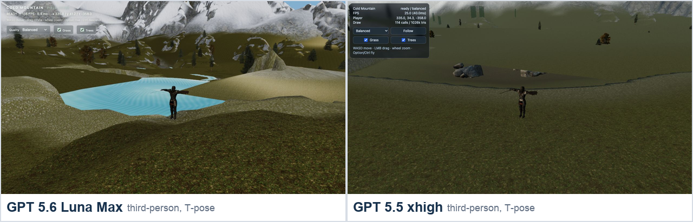

# Cold Mountain 多模型实现评测报告（更新版）

> 评测日期：2026-08-02
> 目标规范：`project-prompt.md`
> 统一运行参数：`?shot=vista&quality=balanced&seed=12345&capture=0`
> 统一视口：1280 × 720 CSS
> 评测环境：Node.js 24.13.1、npm 11.8.0

## 结论摘要

`main` 仍是视觉标杆，总分 **84.5/100**。它包含 GPT 5.6 Sol ultra 的生成结果和后续手动调试，因此不参与纯模型第一名的归属。

本次按用户指定的新来源替换了两项证据：

- **GPT 5.5 xhigh**：以 `~/Desktop/5.5` 的当前目录快照为准，不再使用旧的 `feat/gpt-5.5-test`。
- **GPT 5.6 Luna max**：以仓库 `luna-max` 分支、提交 `ced157a` 为准，不再使用旧的 `gpt-luna` / Luna medium。

更新后的纯模型排名为：

1. **GPT 5.6 Luna max（65.0）**：代码覆盖完整、第三人称成立，固定 vista 稳态约 180 FPS；但水体边界明显几何化，瀑布仍像白色平面，玩家为 T-pose，未达到产品视觉门槛。
2. **GPT 5.5 xhigh（58.0）**：架构、九宫格高度、水文、KTX2 和公开验收接口都较完整，固定 vista 稳态约 76.6 FPS；但湖泊/河流主体在多个固定机位缺失，瀑布机位只拍到草地，玩家同样为 T-pose。
3. **DeepSeek V4 Flash max（57.5）**：系统架构较强，但实际运行结果把强制要求的第三人称做成第一人称，同时树木横倒/悬浮，因此对规范正确性和视觉构图明确扣分。
4. **GPT 5.6 Sol xhigh（56.0）**：代码规模适中、表面 FPS 高，但草 shader 编译失败、湖面存在同心环和三角缺口，当前负载不完整。
5. **GLM 5.2 xhigh（39.5）**：测试最多，但 ready 初始化 TDZ 与水体 shader attribute 缺失导致大片黑洞和水体缺失。

五个纯模型结果仍全部未通过题面规定的产品等价门槛。排名表示这些具体快照之间的相对完成度，不是对应模型的一般能力排名。

## 1. 模型与证据来源

| 评测项 | 来源 | 对应模型 | 本次状态 |
|---|---|---|---|
| 视觉标杆 | `main`（实现基线 `3c5b2ba`） | GPT 5.6 Sol ultra + 手动调试 | 保留 |
| 新 GPT 5.5 | `~/Desktop/5.5` 当前目录快照 | GPT 5.5 xhigh | **替换旧分支证据** |
| 新 Luna | `luna-max`（`ced157a`） | GPT 5.6 Luna max | **替换 Luna medium** |
| DeepSeek | `codex-ds-flash`（`cc12c0a`） | DeepSeek V4 Flash max | 保留 |
| Sol | `test/sol-2`（`8bc682b`） | GPT 5.6 Sol xhigh | 保留 |
| GLM | `feat/GLM-5-2`（`51c3480`） | GLM 5.2 xhigh | 保留 |

`~/Desktop/5.5` 不是 Git 仓库，因此报告记录的是 2026-08-02 复制出的只读评测快照，而不是虚构一个提交号。

## 2. 评分方法

总分 100，分为代码逻辑、视觉效果和性能帧率三大项：

| 一级维度 | 权重 | 二级维度 | 评分原则 |
|---|---:|---|---|
| 代码逻辑 | 40 | 规范正确性 14、架构职责 10、图形/算法质量 8、测试与交付可信度 8 | 以真实代码路径、测试、构建、浏览器错误和题面契约为证据；代码量和测试数量本身不直接加分 |
| 视觉效果 | 40 | 地形 8、水系 7、植被 7、构图/世界完整性 7、材质/光照 6、稳定性 5 | 以 production preview 最终帧为主；贴图、树木、草地、河流、湖泊、瀑布和第三人称均单独观察 |
| 性能帧率 | 20 | 稳态 FPS/帧时间 8、等价可见负载效率 6、p95/1% low 稳定性 3、指标可信度 3 | 高 FPS 不能补偿缺水、缺草、黑洞或占位几何；renderer 统计明显失真时扣可信度 |

### 不可补偿原则

- 固定机位主体缺失、宏观锚点错误或只剩占位几何，先判产品门槛失败。
- shader 编译错误导致草、水或地形层未渲染时，高 FPS 必须折价。
- 第三人称要求以运行结果中“角色可见、跟随构图成立”为准，不能只凭源码类名通过。
- 启动/进入稳定帧的等待时间只做诊断记录，**不参与评分**；标杆 `main` 本身也约需 60 秒。
- 稳态性能窗口、renderer 统计和实际画面相互矛盾时，降低指标可信度，而不是挑选最高数字。

## 3. 总体排名

| 名次 | 来源 | 对应模型 | 代码 /40 | 视觉 /40 | 性能 /20 | 总分 /100 | 产品门槛 |
|---:|---|---|---:|---:|---:|---:|---|
| 标杆 | `main` | GPT 5.6 Sol ultra + 手动调试 | 34.0 | 35.5 | 15.0 | **84.5** | 视觉通过；严格 v2 契约不完整 |
| 1 | `luna-max` | GPT 5.6 Luna max | 29.0 | 21.0 | 15.0 | **65.0** | 未通过：水体/瀑布几何化、玩家 T-pose |
| 2 | `~/Desktop/5.5` | GPT 5.5 xhigh | 30.0 | 14.5 | 13.5 | **58.0** | 未通过：湖河/瀑布固定机位主体缺失、玩家 T-pose |
| 3 | `codex-ds-flash` | DeepSeek V4 Flash max | 28.5 | 18.0 | 11.0 | **57.5** | 未通过：第一人称替代第三人称、树木方向错误 |
| 4 | `test/sol-2` | GPT 5.6 Sol xhigh | 26.5 | 20.5 | 9.0 | **56.0** | 未通过：草 shader 失败、湖面几何错误 |
| 5 | `feat/GLM-5-2` | GLM 5.2 xhigh | 24.5 | 8.5 | 6.5 | **39.5** | 未通过：地形黑洞、水体 shader 失败 |

第二至第四名只相差 2 分：GPT 5.5 的代码和性能优于当前可见效果；DeepSeek 的世界系统更完整，但视角与树资产错误是 P0 交付问题；Sol 的水体构图相对可见，但 shader 缺失污染了性能结果。

## 4. 全景截图对比

下图统一使用 `vista / Balanced / seed=12345 / capture=0`。GPT 5.5 与 Luna max 是本轮重新运行 production preview 后取得的当前帧；其余项目沿用同一轮次已核验的固定机位证据。

### 直接观察

- **main**：山体、湖泊、岩石、草地、树群、湿岸、远景雾和玩家尺度最完整，近景到远景都有层次。
- **Luna max**：雪山、谷地、树木和中央湖泊的宏观构图可读，明显优于旧 Luna medium；但湖岸呈大块折线/矩形，河流像亮青色带，材质尺度和地形接缝仍不自然。
- **GPT 5.5**：雪山与岩石贴图存在，但谷底大面积为空，树木稀疏并夹杂直立矩形块；vista 右下只见一小块水边，湖泊主体没有进入应有构图。
- **DeepSeek V4 Flash**：湖泊和大地形存在，但运行体验是第一人称；大量树木横倒或悬浮，遮挡镜头。
- **GPT 5.6 Sol**：湖面有明显同心环，岸边有三角楔形缺口；草 shader 失败使生态层不完整。
- **GLM 5.2**：大面积黑色地形孔洞，水体缺失，只剩零散植被和调试 HUD。

原始截图：[`main`](screenshots/main-vista.png) · [`Luna max`](screenshots/gpt-5-6-luna-vista.png) · [`GPT 5.5`](screenshots/gpt-5-5-vista.png) · [`DeepSeek`](screenshots/deepseek-v4-flash-vista.png) · [`Sol`](screenshots/gpt-5-6-sol-vista.png) · [`GLM`](screenshots/glm-5-2-vista.png)

## 5. 第三人称专项

新 GPT 5.5 与 Luna max 都在 `spawn` 固定机位中显示可见角色，因此第三人称要求成立；两者都存在 T-pose，说明 FBX 虽已加载，idle/walk 动画绑定或素材动画有效性没有通过最终帧验证。

DeepSeek 的扣分保持不变：源码中虽然有 `ThirdPersonCamera` 和玩家模型加载路径，但实际运行结果是第一人称。题面要求的是最终体验，不能用类名或配置抵消运行行为错误。该问题计入规范正确性和视觉构图，不因镜头变化机械调整性能分。

原始截图：[`Luna max spawn`](screenshots/gpt-5-6-luna-spawn.png) · [`GPT 5.5 spawn`](screenshots/gpt-5-5-spawn.png)

## 6. 瀑布专项截图

瀑布图用于观察落差、水幕、白水、落水潭与岩壁融合。该组不单独计算统一 FPS。

- **Luna max**：机位能看到瀑布，但主体近似白色竖直平面，缺少可信透明度、厚度、飞沫和落水潭连续性。
- **GPT 5.5**：当前固定机位只显示近距离草地，瀑布主体完全缺失，属于固定机位/布局契约失败。
- **DeepSeek V4 Flash**：落水、河槽和白水结构可见，但白色条块过硬，周围横倒树木继续破坏可信度。
- **GLM 5.2**：岩壁细节尚可，但水体/白水没有形成有效瀑布主体。

原始截图：[`Luna max`](screenshots/gpt-5-6-luna-waterfall.png) · [`GPT 5.5`](screenshots/gpt-5-5-waterfall.png) · [`DeepSeek`](screenshots/deepseek-v4-flash-waterfall.png) · [`GLM`](screenshots/glm-5-2-waterfall.png)

## 7. 视觉评分明细

| 来源 | 地形 /8 | 水系 /7 | 植被 /7 | 构图与完整性 /7 | 材质与光照 /6 | 稳定性 /5 | 视觉总分 /40 |
|---|---:|---:|---:|---:|---:|---:|---:|
| `main` | 7.5 | 6.5 | 6.0 | 6.0 | 5.5 | 4.0 | **35.5** |
| `luna-max` | 5.5 | 3.5 | 3.0 | 3.5 | 3.5 | 2.0 | **21.0** |
| `test/sol-2` | 6.0 | 4.0 | 2.5 | 2.0 | 4.0 | 2.0 | **20.5** |
| `codex-ds-flash` | 6.0 | 4.5 | 2.5 | 0.0 | 4.0 | 1.0 | **18.0** |
| `~/Desktop/5.5` | 4.0 | 1.0 | 2.0 | 2.0 | 3.5 | 2.0 | **14.5** |
| `feat/GLM-5-2` | 3.0 | 1.5 | 0.5 | 1.5 | 1.5 | 0.5 | **8.5** |

GPT 5.5 的视觉分低并非否定其材质与水文代码，而是因为多个固定机位没有交付代码所声明的主体。Luna max 的宏观可读性明显提高，但其 21 分仍只是“系统可见”，不代表水体、瀑布和角色已达到成片质量。

## 8. 性能与帧率

### 本轮统一实测

GPT 5.5 和 Luna max 均使用 production build、1280×720、Balanced、固定 vista、`capture=0`。进入 ready 后连续读取 15 次 HUD，每次间隔约 1 秒；等待时间只记录、不计分。

| 来源 | 稳态 FPS / 帧时间 | 画面负载证据 | 等待（仅记录） | 浏览器错误 | 结论 |
|---|---|---|---|---|---|
| `~/Desktop/5.5` | **平均约 76.6 FPS / 13.1 ms**；范围 75.7–77.2 FPS | 119 calls / 1.07M tris；水体和植被可见负载不完整 | 本轮约 15 秒进入可采样状态 | 0 error / 0 warn | 帧率和短窗稳定性可信，但不能当作完整世界负载 |
| `luna-max` | **15 次均显示 180 FPS / 5.6 ms** | 湖、河、树、山均可见；HUD/acceptance 的 1 call / 1 triangle 明显失真 | 本轮约 15–25 秒进入可采样状态 | 0 应用 error / 0 应用 warn | FPS 采样稳定，renderer 负载统计不可信 |

Luna 的 `MetricsTracker` 使用真实 RAF 时间戳维护 10 秒滑动窗口，因此 FPS 路径本身成立；但 EffectComposer 渲染后读取 `renderer.info`，提交验收中长期出现 1 call / 1 triangle，与画面矛盾，故“指标可信度”只得 1 分。

GPT 5.5 将 `renderer.info.autoReset` 关闭，并在每帧前手动 `reset()`，当前 119 calls / 1.07M triangles 与画面规模基本相容；不过报告没有把其旧的截图模式 acceptance 极低 FPS 纳入稳态评分，因为截图读回阻塞和极小样本会污染结果。

### 性能评分明细

| 来源 | 稳态 FPS /8 | 等价可见负载 /6 | p95/1% low 稳定性 /3 | 指标可信度 /3 | 性能总分 /20 |
|---|---:|---:|---:|---:|---:|
| `main` | 5.0 | 6.0 | 2.0 | 2.0 | **15.0** |
| `luna-max` | 8.0 | 3.0 | 3.0 | 1.0 | **15.0** |
| `~/Desktop/5.5` | 6.5 | 2.5 | 2.5 | 2.0 | **13.5** |
| `codex-ds-flash` | 5.5 | 3.0 | 1.0 | 1.5 | **11.0** |
| `test/sol-2` | 8.0 | 0.5 | 0.0 | 0.5 | **9.0** |
| `feat/GLM-5-2` | 6.5 | 0.0 | 0.0 | 0.0 | **6.5** |

GLM 的 `getMetrics()` 把 p95 和 1% low 固定为 0，且水体/地形负载缺失，因此只有表面稳态 FPS 得分。

性能排名不能脱离可见内容解释：Luna 的 180 FPS 是轻量、几何化场景的有效结果；main 的 42.1 FPS 承载 1,731 calls 和约 17.2M triangles，仍是更可信的完整视觉基线。

## 9. 代码逻辑与工程质量

### 构建、测试和规模

所有来源均完成独立依赖安装、测试和生产构建。新两项的结果如下：

| 来源 | src 文件 / LOC | test 文件 / LOC | 测试 | 生产 JS | 安装/构建备注 |
|---|---:|---:|---:|---:|---|
| `main` | 50 / 23,827 | 39 / 11,330 | 276/276 | 1,220.58 kB | 既有基线通过 |
| `~/Desktop/5.5` | 28 / 4,353 | 6 / 264 | 22/22 | 913.75 kB | `npm ci` 0 漏洞；构建通过，存在大 chunk 警告 |
| `luna-max` | 28 / 3,108 | 4 / 150 | 15/15 | 901.16 kB | `npm ci` 报 1 个 high severity 漏洞；构建通过，存在大 chunk 警告 |
| `codex-ds-flash` | 36 / 6,529 | 7 / 564 | 41/41 | 976.88 kB | 既有基线通过 |
| `test/sol-2` | 22 / 2,085 | 4 / 233 | 28/28 | 909.97 kB | 既有基线通过 |
| `feat/GLM-5-2` | 17 / 4,193 | 8 / 917 | 74/74 | 250.62 kB | 既有基线通过 |

### 代码评分明细

| 来源 | 规范正确性 /14 | 架构职责 /10 | 图形算法 /8 | 测试与可信度 /8 | 代码总分 /40 |
|---|---:|---:|---:|---:|---:|
| `main` | 11.0 | 7.0 | 8.0 | 8.0 | **34.0** |
| `~/Desktop/5.5` | 9.5 | 8.5 | 7.0 | 5.0 | **30.0** |
| `luna-max` | 9.5 | 8.5 | 6.5 | 4.5 | **29.0** |
| `codex-ds-flash` | 6.5 | 9.0 | 7.5 | 5.5 | **28.5** |
| `test/sol-2` | 8.5 | 7.5 | 6.0 | 4.5 | **26.5** |
| `feat/GLM-5-2` | 6.0 | 7.5 | 5.5 | 5.5 | **24.5** |

### 新 GPT 5.5：`~/Desktop/5.5`

- 优点：`src/world/sceneLayout.js` 作为数据真源；`HeightSampler` 同时读取 `height.webp` 与 `nine-grid-height.png`；terrain、hydrology、water、vegetation、third-person camera、quality、metrics 和公开 API 均分模块实现。
- 优点：KTX2Loader 调用 `detectSupport(renderer)`，terrain 材质绑定岩石、雪、森林、湿岸、河床和砾石纹理；`renderer.info.autoReset=false` 让 draw/triangle 统计路径比多数分支更可信。
- 扣分：`loaded.grass/trees` 在资产仍异步加载时直接置为 true，并主动标记 `vegetation-assets-loading-fallback-visible`；“ready”语义不能保证最终生态层已经完整。
- 扣分：源码创建 waterfall ribbons、foam 和 mist，但当前 waterfall 固定机位完全看不到主体；FBX stand/walk 路径存在，最终角色仍为 T-pose。测试没有覆盖 WebGL 最终帧、固定机位主体和动画有效性。
- 判断：代码结构值得保留，但视觉契约失败较多；第一优先级应是修正固定机位/水体坐标一致性、等待真实植被 ready，并为动画与主体可见性增加 production smoke test。

### 新 Luna max：`luna-max`

- 优点：3,108 行源码覆盖资产加载、统一布局、高度采样、水文、terrain、river/lake geometry、waterfall、植被、第三人称、后处理和 v2 API；模块规模适中。
- 优点：河流显式生成 `aFlow/aLateral/aFoam` attributes，瀑布有多层 ribbon、mist 和 pool foam；相较旧 Luna medium 已不再是 566 行低多边形最小原型。
- 扣分：湖岸和河流在最终帧中仍是明显折线/矩形带，waterfall shader 的几何结果接近白色板；实现复杂度没有转化为同等视觉质量。
- 扣分：`MetricsTracker` 的 FPS 路径合理，但 EffectComposer 后的 renderer 统计失真；FBX 逻辑只检查模型对象存在，没有把有效 idle clip 和实际骨骼动画列为 ready 条件。依赖安装还报告 1 个 high severity 漏洞。
- 判断：是当前纯模型中最均衡的继续开发起点；优先修湖岸贴合、瀑布透明/厚度、玩家动画和 renderer.info 采样边界。

### DeepSeek、Sol 与 GLM 的保留判断

- **DeepSeek**：terrain/water/vegetation/debug/metrics 的职责拆分仍是纯模型中最清晰；但实际第一人称违反 P0 第三人称要求，树资产最长轴启发式归一化也被最终帧证明错误。
- **Sol**：高度图、水文、API 和 metrics 路径齐全；草 shader 注入后缺少 `uWindTime/uPlayer` 声明，renderer.info 又显示 1 call / 0k tris。
- **GLM**：74 个测试不能替代浏览器 shader 验收；ready Promise 的 TDZ、水体 attribute 缺失和硬编码 p95/1% low 都属于测试未覆盖的运行错误。

## 10. 分支级建议

| 目标 | 推荐起点 | 原因 | 首要修复 |
|---|---|---|---|
| 纯模型结果继续迭代 | `luna-max` | 当前代码、宏观画面和帧率最均衡 | 湖岸/河道贴合、瀑布材质、玩家动画、renderer 指标 |
| 复用材质与水文代码 | `~/Desktop/5.5` | KTX2、九宫格高度和材质系统完整 | 固定机位/水体坐标、真实植被 ready、动画 smoke test |
| 复用系统架构 | `codex-ds-flash` | 模块边界和系统覆盖完整 | 第三人称运行行为、树/草资产离线归一化、尾延迟 |
| 小规模代码继续迭代 | `test/sol-2` | 规模适中、主要数据路径存在 | grass shader、湖面几何、renderer.info |
| 视觉产品基线 | `main` | 当前实际效果显著领先 | 补 v2 验收 API，并优化 draw calls 与三角形负载 |

## 11. 复现过程与限制

1. 对 `~/Desktop/5.5` 建立不含 `node_modules/dist` 的隔离快照；对 `luna-max@ced157a` 建立 detached worktree。
2. 分别运行 `npm ci`、`npm test`、`npm run build`。
3. 用 production preview 打开 `vista / balanced / seed=12345 / capture=0`，统一视口为 1280×720。
4. 等待 ready 后连续读取 15 次 HUD FPS，并记录应用控制台 error/warn。
5. 另外采集 `spawn` 与 `waterfall` 固定机位，检查第三人称和瀑布主体。
6. 对照源码检查布局、高度图、水文、植被、shader、metrics 和公开验收 API，再用最终帧校正代码声明。

限制如下：

- 各实现 HUD/metrics 的内部实现不同，本报告没有把所有 HUD 数字假设为完全相同的独立 RAF 基准。
- 新两项没有在同一工具层取得完整 p95/1% low 原始数组，因此稳定性分以 15 秒 HUD 范围、代码统计路径和既有 acceptance 的可信度共同判断。
- 启动/进入稳定帧的等待时间不计分；缺少稳定后的有效样本才会影响指标可信度，两者不混为一谈。
- DeepSeek 的第一人称结论来自实际运行体验；即使源码定义第三人称类，仍按最终结果扣分。
- 报告评价的是列出的具体快照，不是模型品牌或推理档位的普遍排名。

## 12. 最终结论

以本次更新证据看，**GPT 5.6 Luna max 是纯模型实现中最均衡的起点**：它不再像旧 Luna medium 那样只交付极简原型，并以完整模块、可见第三人称和高稳态 FPS 取得 65 分；但 65 分距离产品门槛仍有明显差距，水体、瀑布和人物动画都需要实质修复。

**最新 GPT 5.5 xhigh** 的代码质量高于其 58 分总成绩所表现的视觉结果。它的主要问题不是“没有实现系统”，而是固定机位、异步 ready 和最终资产状态没有把这些系统正确交付出来。**DeepSeek V4 Flash max** 仍因第一人称替代第三人称被明确扣分；在这一扣分后，它以 57.5 分紧随 GPT 5.5。Sol 的 shader 缺失和 GLM 的运行错误继续限制其排名。

若目标是最终画面，`main` 仍应作为不可替代的视觉标杆；若目标是从纯模型代码继续修，优先顺序应为 `luna-max`，其次是 `~/Desktop/5.5`，然后才是修正视角与资产坐标系后的 `codex-ds-flash`。

---

机器可读评分数据见 [`data/results.json`](data/results.json)，对比图生成脚本见 [`data/build_comparisons.py`](data/build_comparisons.py)。
